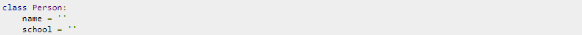
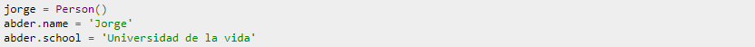
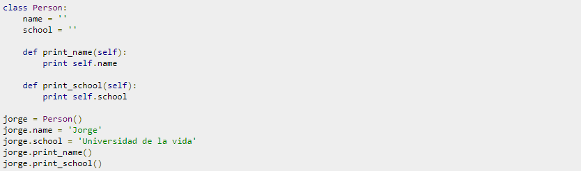
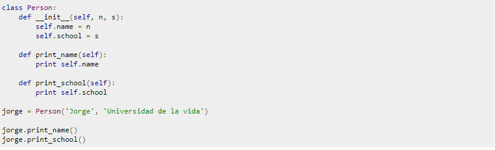

# Clases y Objetos #

 Sirven para crear tu propio tipo de datos (es decir, tipos de datos definidos por el usuario). Una clase es un tipo de dato definido por el usuario, y al crear instancias de una clase hace relación a la creación de objetos de ese tipo. Las clases y los objetos son considerados los principales bloques de desarrollo para Python, el cual es un lenguaje de programación orientado a objetos.

 ## ¿Cómo crearíamos una clase en Python? ##

la definición de una clase comienza con la palabra clave __class__, y *className* sería el nombre de la clase (identificador). Ten en cuenta que el nombre de la clase sigue las mismas reglas que los nombres de variables en Python, es decir, sólo pueden comenzar con una letra o un subrayado , y sólo pueden contener letras, números o guiones bajos.

-Ahora vamos a definir una __class__ *Person (persona)*, que por el momento no contendrá nada, excepto la declaración de pass. Según la documentación de Python:

La sentencia pass no hace nada. Puede ser utilizada cuando se requiere una sentencia sintácticamente pero programa no requiere acción alguna.

Para crear una instancia (objeto) de esta clase, haremos lo siguiente:

Esto significa que hemos creado un nuevo objeto jorge del tipo Person. Date cuenta que para crear un objeto solo debemos escribir el nombre de la clase, seguido de unos paréntesis.

## Atributos ##

Los atributos son como propiedades que queremos añadir a la clase (tipo). Por ejemplo, para nuestra clase *Person*, vamos a añadir dos atributos: name y school, tal que así:

Ahora, vamos a crear un nuevo objeto del tipo *Person* con más detalle, completando estos atributos que acabamos de añadir:

## Métodos ##
Los métodos son cómo funciones en **Python**, ya que se definen con la palabra clave def y cuentan con el mismo formato que las funciones. En nuestra clase, vamos a definir un método que imprima el nombre (name) y la escuela (school) de una persona (*Person*). La clase se verá de la siguiente manera:

## Inicialización ##

En la sección anterior, hemos inicializado name y school, dándoles un valor vacío ''. Pero hay una forma más elegante de inicializar variables con sus valores predeterminados. El inicializador es un método especial, con nombre __init__ (el método se considera especial y será tratado de forma especial, es por eso que tiene subrayados dobles al principio y al final).

Vamos a modificar el programa anterior para utilizar el inicializador. En este caso, el programa se verá como sigue:

