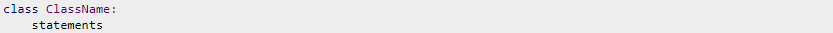
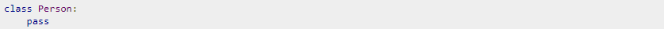
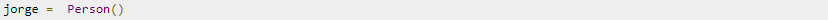

# Clases y Objetos #

 Sirven para crear tu propio tipo de datos (es decir, tipos de datos definidos por el usuario). Una clase es un tipo de dato definido por el usuario, y al crear instancias de una clase hace relación a la creación de objetos de ese tipo. Las clases y los objetos son considerados los principales bloques de desarrollo para Python, el cual es un lenguaje de programación orientado a objetos.

 ## ¿Cómo crearíamos una clase en Python? ##

la definición de una clase comienza con la palabra clave __class__, y *className* sería el nombre de la clase (identificador). Ten en cuenta que el nombre de la clase sigue las mismas reglas que los nombres de variables en Python, es decir, sólo pueden comenzar con una letra o un subrayado , y sólo pueden contener letras, números o guiones bajos.

-Ahora vamos a definir una __class__ *Person (persona)*, que por el momento no contendrá nada, excepto la declaración de pass. Según la documentación de Python:

La sentencia pass no hace nada. Puede ser utilizada cuando se requiere una sentencia sintácticamente pero programa no requiere acción alguna.

Para crear una instancia (objeto) de esta clase, haremos lo siguiente:

Esto significa que hemos creado un nuevo objeto jorge del tipo Person. Date cuenta que para crear un objeto solo debemos escribir el nombre de la clase, seguido de unos paréntesis.
